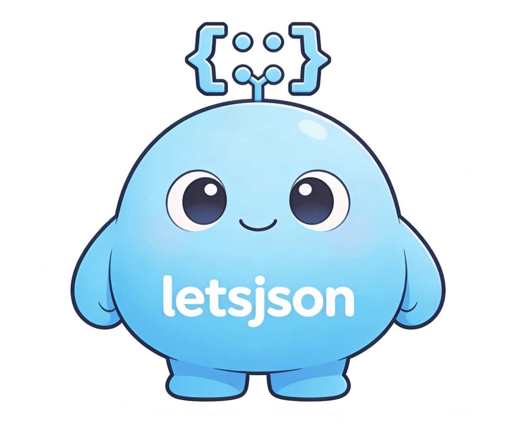

<p align="center">
  
</p>

# LetsJSON
Let LLMs generate exactly the JSON you define.

[中文文档](docs/zh.md)

Generate strongly constrained JSON from LLM outputs:
- Validate fields and types against your schema
- Auto-retry on invalid outputs (default: 3 attempts)
- Raise an error if all retries fail or return empty value
- It's very liteweight, with only 230+ lines of code.

## Installation

```bash
uv add letsjson
```

or:

```bash
pip install letsjson
```

## Usage

```python
from openai import OpenAI
from letsjson import LetsJSON

client = OpenAI(
    api_key="your API key",
    base_url="your API base URL",
)
generator = LetsJSON(client, model="your model name")  # repeat is optional, default is 3

schema = {
    "title": str,
    "steps": [{"time": str, "location": str, "detail": str}],
}
result = generator.gen("Give me a 2-day London travel plan", schema)
print(result)

# Streaming output (optional)
result = generator.gen_stream(
    "Give me a 2-day London travel plan",
    schema,
    on_chunk=lambda chunk: print(chunk, end="", flush=True),
)
print("\n--- parsed json ---")
print(result)

# return:
# {
#   "title": "2-Day London Travel Plan",
#   "steps": [
#     {"time": "Day 1 Morning",
#      "location": "British Museum", 
#      "detail": "Explore ancient artifacts and world history."},
#    {"time": "Day 1 Afternoon",
#     "location": "Covent Garden",
#     "detail": "Enjoy street performances and shopping."},
#   ...
#  ]
```

## Supported Schema Types

- Object: `{"name": str, "age": int}`
- List: `{"items": [str]}` (list schema must contain exactly one element type)
- Nested: `{"user": {"name": str}, "tags": [str]}`
- Strict type checks:
  - `int` does not accept `bool`
  - `float` accepts `int` and `float` (does not accept `bool`)
